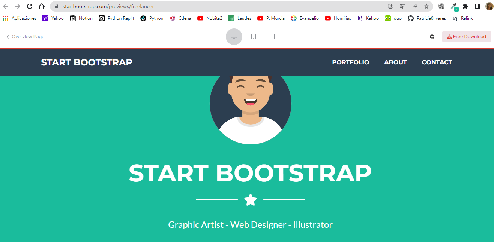
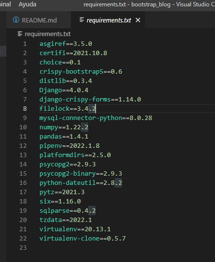

# telovendo9_postgresql

## TeLoVendoPOD
## Tabla de Contenidos

## Información General 
Aplicación para ofrecer servicios de gestión de formularios, y recibir antecedentes de desarrolladores.
Restringe acceso a usuario no registrado a página de inicio solamente, y restricciones según usuario: grupo administradorcliente, grupo administradorproveedor y un tercer grupo administrador_tlv con acceso a gestión de clientes y proveedores.
	
## Tecnologías
Este proyecto fue creado usando:
* HTML
* CSS
* Boostrap
* JavaScript
* JQuery
* Crispy Forms

**Proyecto basado en el template gratuito de la siguiente página:**
-https://startbootstrap.com/theme/freelancer



	
## Instalación
Puede descargar este proyecto desde https://github.com/Patricia0livares

## Instrucciones para instalación

## Instalación

-Clonar el repositorio usando ``` git clone ```
-Se abre la carpeta en un editor Visual Studio Code.

-Se abre un nuevo terminal en Visual Studio Code y se crea el entorno virtual con el comando:
```pip install venv venv ```
-Se activa el entorno virtual:
```cd venv/Scripts/activate ```
-Despues de volver a la carpeta principal con cd .. Se instala los requerimientos
-asgiref==3.5.0
-certifi==2021.10.8
-choice==0.1
-crispy-bootstrap5==0.6
-distlib==0.3.4
-Django==4.0.4
-django-crispy-forms==1.14.0
-filelock==3.4.2
-mysql-connector-python==8.0.28
-numpy==1.22.2
-pandas==1.4.1
-pipenv==2022.1.8
-platformdirs==2.5.0
-psycopg2==2.9.3
-psycopg2-binary==2.9.3
-python-dateutil==2.8.2
-pytz==2021.3
-six==1.16.0
-sqlparse==0.4.2
-tzdata==2022.1
-virtualenv==20.13.1
-virtualenv-clone==0.5.7
-Con el siguiente comando:
```pip install -r requirements.txt```
-Se hacen las migraciones con el comando:
``` python manage.py migrate```
-Se crea el superusuario para acceder al admin:
```python manage.py createsuperuser```
-Se levanta el servidor con:
``` python manage.py runserver```

**Base de Datos en PostgreSQL:** 
Más información para la correcta instalación en:
https://docs.djangoproject.com/en/4.0/ref/databases/

## Librerías usadas



